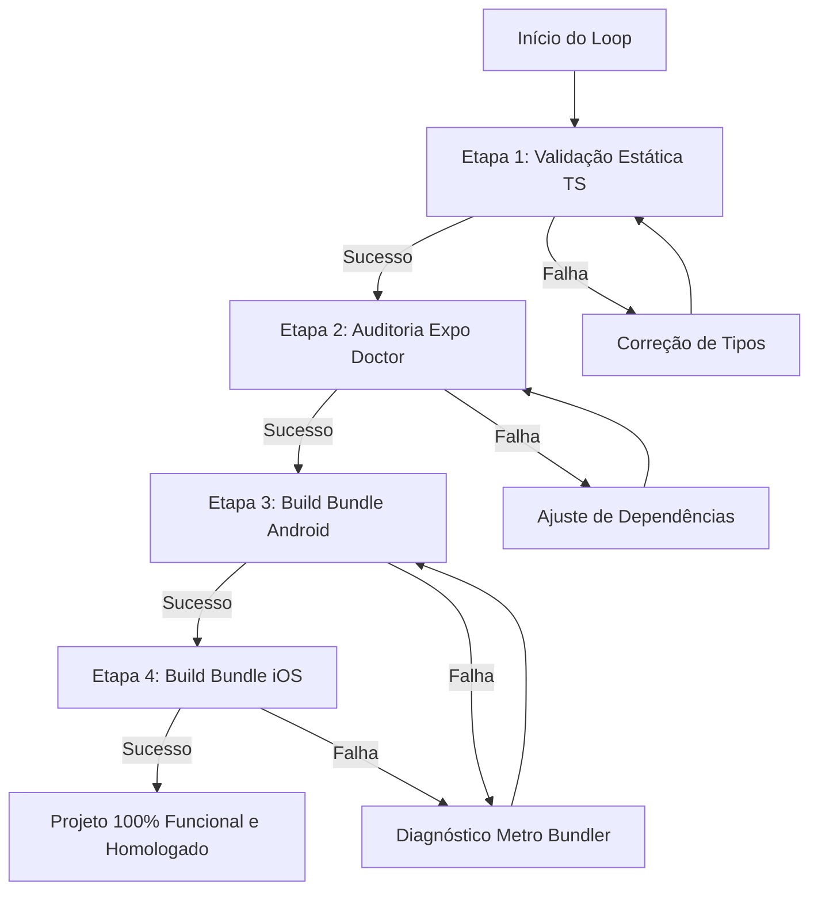

# Build QA Loop Skill

Esta skill define o protocolo de validação contínua e ciclo fechado de resolução de problemas (auto-remediação).

## Protocolo de Execução do Loop

O especialista em QA executa o pipeline em 4 etapas sequenciais:



### Comandos de Validação
1. **Checagem de Tipos**:
   ```bash
   npx tsc --noEmit
   ```
2. **Checagem de Dependências Expo**:
   ```bash
   npx expo install --check
   ```
3. **Empacotamento Metro (Android)**:
   ```bash
   npx expo export --platform android
   ```
4. **Empacotamento Metro (iOS)**:
   ```bash
   npx expo export --platform ios
   ```

### Critérios de Sucesso
- 0 erros em `tsc --noEmit`.
- Todas as dependências validadas pelo Expo SDK.
- Bundles Metro gerados com sucesso para Android e iOS.
